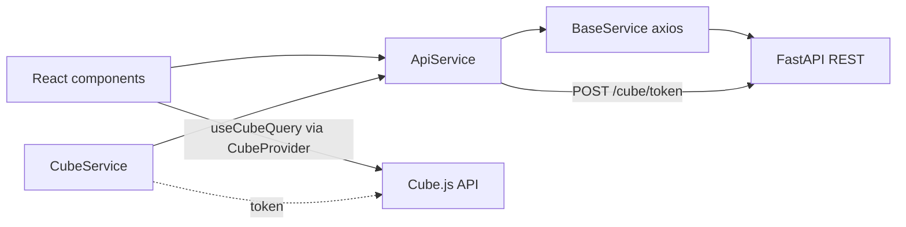

# API & Cube.js — E2E reference

English reference for Playwright and QA: how the dashboard calls **REST** and **Cube.js**, what appears on the wire, and how that maps to E2E hooks.

**Updated:** 2026-05-21  
**Source:** Synced from webapp (`docs/webapp/api-and-cube.md`). Web UI runs at `APP_URL` (local `http://localhost:3000` or deployed).

**Scope:** Real **REST** and **Cube.js** only. Dev **showcase mocks** (`mockData/showcaseConfig.js`) are **out of scope** — E2E/UAT assumes live backends and UI login (or `appApi` with the same headers).

---

## 1. Two data layers

| Layer | Base URL (env) | Auth | Typical use |
|-------|----------------|------|-------------|
| **REST API** | `REACT_APP_ROOT_API` → `configs/apis.js` (`rootAPI`, default `http://localhost:8000/api/v1`) | JWT + tenant + farm headers | Login, farms, locations, animals, alerts, **tag stats**, weather |
| **Cube.js** | `REACT_APP_CUBE_API` → `API.cubeAPI` (default staging Cube URL) | Short-lived token from REST `POST {rootAPI}/cube/token` | Weekly charts (tags deployed, health alerts/events), room conditions, animal time series |



**E2E rule of thumb:** UI hooks on `/dashboard` and `/overview` for **weekly bar charts** usually reflect **Cube** (`snowflake_*` measures). **Active tag counts** (`active-tags-xiot-g/s`) come from **REST** `/stats/tags` or `/stats/room-tags`. See [§4](#4-registered-routes-data-source-map).

---

## 2. Environment variables

### Webapp (build-time)

| Variable | Purpose |
|----------|---------|
| `REACT_APP_ROOT_API` | REST base (all paths in `configs/apis.js`) |
| `REACT_APP_CUBE_API` | Cube HTTP API root |

CRA embed at `npm start` / `npm run build`. See webapp `.sample.env`. Changing `.env` requires dev server restart or rebuild.

### Playwright repo (runtime)

| Webapp | Playwright `.env` | Notes |
|--------|-------------------|--------|
| `REACT_APP_ROOT_API` | `API_BASE_URL` | Same host/path the UI calls (e.g. `https://api.dev.xiot.com.au/api/202312`) |
| `REACT_APP_CUBE_API` | `CUBE_API_URL` | Same Cube deploy as UI |
| — | `APP_URL` | Dashboard under test (`http://localhost:3000` or UAT) |
| — | `APP_USER` / `APP_PASS` | Same credentials as UI login |
| — | `APP_TENANT_IDENTIFIER` | `X-Tenant-Identifier` |
| — | `APP_API_FARM_IDENTIFIER` | `X-Farm-Identifier` when `APP_FARM_IDENTIFIER` is a display label |
| — | `APP_LOCATION_IDENTIFIER` | Room `/stats/room-tags` scope |
| — | `APP_TIMEZONE` | Cube `timezone` (default `Australia/Perth`) |

Clients: `lib/api/`, `lib/cube/dashboard/oracles.ts`, `configs/*` — fixtures `appApi`, `cubeApi`. Probes: `npm run probe -- health`.

---

## 3. REST API call chain

### 3.1 Flow

1. View / thunk calls `services/*` (e.g. `apiGetTagsStats`, `apiSignIn`).
2. Service calls `ApiService.fetchData({ url, method, data, params, headers, skipFarmHeader })`.
3. **`BaseService`** (axios) with interceptors → network to `REACT_APP_ROOT_API`.

### 3.2 Request headers (every real REST call)

Set in `services/BaseService.js` from **redux-persist** (`PERSIST_STORE_NAME`) with fallback to `store.getState().auth.session` for token only:

| Header | Constant | When |
|--------|----------|------|
| `Authorization` | `Bearer {token}` | If token present |
| `X-Tenant-Identifier` | `REQUEST_HEADER_IDENTIFIER` | If tenant in session (unless overridden per request) |
| `X-Farm-Identifier` | `REQUEST_HEADER_FARM_IDENTIFIER` | If farm in session and **`skipFarmHeader` is not true** |

**Examples without farm header:** `apiGetFarms` (tenant-only header for farm list during tenant pick).

### 3.3 Response handling (E2E-relevant)

| Status / `detail` | App behavior |
|-------------------|--------------|
| `401` | Toast (once), `onSignOutSuccess()` → redirect sign-in |
| `INVALID_MEMBERSHIP`, `INACTIVE_TENANT`, `INACTIVE_FARM`, `FARM_NOT_FOUND` | Toast, refresh `apiMe`, reselect tenant/farm or sign out |
| `INACTIVE_LOCATION` | Refetch `getCommonLocation()` |

Playwright sessions must keep the same headers the app would send (or use UI login so persist storage is populated).

### 3.4 URL catalog (`configs/apis.js`)

Paths are absolute URLs built from `REACT_APP_ROOT_API`.

| Area | Key endpoints |
|------|----------------|
| Auth | `POST .../auth/login`, `POST .../auth/forgot-password`, `POST .../auth/reset-password`, `GET .../users/me` |
| Cube token | `POST .../cube/token` body `{ type: "backend" }` (only type used in layout bootstrap today) |
| Farm | `GET .../farms`, `GET .../farms/current`, `PUT .../farms/current/barn-categories-layout` |
| Location / pen | `GET .../locations/`, `GET .../locations/:location_id`, pen CRUD paths |
| Animals | `GET .../animals/`, `GET .../animals/:animal_id`, `GET .../animals/get-by-tag/:tagId`, observation upload |
| Alerts / tasks | `GET .../alerts/`, `GET .../alerts-list/`, `GET .../management-tasks`, `GET .../monitor-tasks`, `POST .../daily-tasks` |
| Stats (REST, not Cube) | `GET .../stats/tags` (farm), `GET .../stats/room-tags` (room, query params) |
| Other | `GET .../weather-forecast`, `GET .../event-logs`, breeding/litter paths |

**Sign-up exception:** `AuthService.apiSignUp` uses relative `url: '/sign-up'` → axios `baseURL` `/api` from `app.config.js`, not `REACT_APP_ROOT_API`.

### 3.5 Service modules (entry points)

| File | Examples |
|------|----------|
| `AuthService.js` | `apiSignIn`, `apiMe`, `apiForgotPassword` |
| `FarmService.js` | `apiGetFarms`, `apiGetFarmDetail`, `apiGetTagsStats` |
| `LocationService.js` | locations, pens |
| `AnimalService.js` | animals, tasks, breeding |
| `AlertsService.js` | alerts, event logs |
| `WeatherForecastService.js` | farm weather |
| `CubeService.js` | `apiGetCubeToken(type)` |

Thunks in `views/*/store/dataSlice.js` typically `await apiX()` then `return response.data`.

---

## 4. Registered routes: data source map

Routes from `configs/routes.config/index.js`. Hooks: [`pages/farm-dashboard.md`](./pages/farm-dashboard.md), [`pages/room-dashboard.md`](./pages/room-dashboard.md).

### `/dashboard` — FarmDashboard

| UI panel | UI hooks | Data source | Query / endpoint |
|----------|----------|-------------|------------------|
| Farm details | `farm-detail-*` | REST | `GET /farms/current` → `getFarmDetail()` |
| Current inventory (active tags) | `active-tags-xiot-g`, `active-tags-xiot-s` | REST | `GET /stats/tags` → `getTagsStats()` |
| Tags deployed (weekly bars) | `farm-tags-*` | **Cube** | [`farm-tags-deployed-cube.md`](./farm-tags-deployed-cube.md) |
| Health alerts (weekly stacked) | `farm-alerts-*` | **Cube** | `'farm-health-alerts'` |
| Health events (weekly grouped) | `farm-events-*` | **Cube** | `'farm-health-alert-responses'` |
| Weather | (no E2E doc) | REST | `GET /weather-forecast` |

### `/overview` — RoomDashboard

| UI panel | UI hooks | Data source | Query / endpoint |
|----------|----------|-------------|------------------|
| Current inventory | `active-tags-xiot-g/s` | REST | `GET /stats/room-tags` (location params) |
| Tags deployed | `room-tags-*` | **Cube** | `'room-tags-deployed'` — filter `snowflake_inventory_tracking.location_id` |
| Health alerts | `room-alerts-*` | **Cube** | `'room-health-alerts'` |
| Health events | `room-events-*` | **Cube** | `'room-health-alert-responses'` |
| Room conditions | room doc | **Cube** | `'room-conditions'`, `'room-conditions-today'` |

### 4.1 Auth bootstrap (before hooks are meaningful)

`components/layout/index.js` when `authenticated`:

1. `getMe()` → `GET /users/me`
2. `apiGetCubeToken("backend")` → `POST /cube/token` → create `@cubejs-client/core` client in Redux `cube.cubeApiBackend`
3. `getFarmDetail()` → `GET /farms/current`
4. Timezone → `moment.tz.setDefault`
5. `getCommonLocation()` → locations

`SimpleLayout` wraps routes with `<CubeProvider cubejsApi={cubeApiBackend}>` so `useCubeQuery` works under protected pages.

---

## 5. Cube.js usage

### 5.1 Token and client

```text
POST {REACT_APP_ROOT_API}/cube/token
Body: { "type": "backend" }
Response: { "token": "<jwt>" }

Client: cube(token, { apiUrl: REACT_APP_CUBE_API })
Stored: state.cube.cubeApiBackend
```

`cubeTokenTypeSnowflake` / `setCubeApiSnowflake` exist in slice but **layout only initializes `backend`** today.

Cube HTTP calls go to **`REACT_APP_CUBE_API`** (browser → Cube), not through `BaseService`, but token issuance uses REST with the same auth headers.

### 5.2 Query pattern in components

Farm/room dashboard charts build a **Cube query object** and load it through **`useCubeQuery`** (`@cubejs-client/react`) inside `<CubeProvider>` (`SimpleLayout.js`). In code the hook is often wrapped by `useShowcaseCubeData`; for E2E replay on UAT, use the **query JSON** below and ignore any dev-only mock branch.

- Farm charts filter `snowflake_inventory_tracking.farm` = `farm.identifier` from `GET /farms/current`.
- Room charts filter `snowflake_inventory_tracking.location_id` = current location id.

### 5.3 Tags deployed chart

Full step-by-step Cube calls, query JSON, pivot mapping, and Playwright examples: **[`farm-tags-deployed-cube.md`](./farm-tags-deployed-cube.md)**.

### 5.4 Other farm Cube charts (summary)

**Health alerts (stacked):** `HealthAlertsChart.js` — measures `sum_alert_generated`, `sum_medication_scheduled`, `sum_added_by_web`, `sum_added_by_mobile`; hooks `farm-alerts-*`.

**Health events (grouped):** `HealthAlertsReponsesChart.js` — measures `sum_medicated_pigs`, `sum_high_medication_pigs`, `sum_recovered_pigs`, `sum_confirmed_dead_pigs`; hooks `farm-events-*`. Chart shape: series = week — see [`README.md`](./README.md).

### 5.5 Timezone and weeks

- Timezone: `state.base.tenantSetting.timezone` (set after farm detail in layout).
- Week boundaries: ISO weeks via `moment` (`startOf("isoWeeks")` / `endOf("isoWeeks")`); Cube `inDateRange` uses `formatTimestampQueryCube`.
- E2E week keys: `this-week`, `prev-1`, `prev-2`, `prev-3` — not calendar dates in testids.

---

## 6. E2E strategies (aligned with PLAYWRIGHT-HANDOFF)

| Test type | Compare UI hooks to | Notes |
|-----------|---------------------|-------|
| **`@business` (QC gate)** | **Admin API** | Source of truth for business acceptance; dynamic expected values |
| **`@contract` (optional)** | **Same Cube query or REST call** the UI uses | Catches mapping/week-index bugs; does **not** prove backend correctness |
| **Smoke** | Hooks present + numeric parse | No hardcoded counts |

**Reading UI values**

- Charts: sr-only `data-testid` only — not Apex SVG ([`PLAYWRIGHT-HANDOFF.md`](./PLAYWRIGHT-HANDOFF.md)).
- Active tags: `active-tags-xiot-g` / `active-tags-xiot-s` visible text (REST-driven).

**Replaying Cube for `@contract`**

1. Obtain token: `POST {ROOT_API}/cube/token` with same `Authorization`, `X-Tenant-Identifier`, `X-Farm-Identifier` as UI session.
2. `POST {CUBE_API}/load` with the JSON query from the component (or Network tab capture).
3. Apply same `timezone` and farm/location filters.
4. Map pivot row to week key, then to hook via `getChartSeriesCountsByWeek` logic in webapp `src/utils/chart.js`.

**Replaying REST for `@contract`**

- Farm active G/S: `GET {ROOT_API}/stats/tags` with farm headers — `appApi.getCurrentInventoryGCount()` / `SCount()`.
- Room active G/S: `GET {ROOT_API}/stats/room-tags?location_id=` — `appApi.getRoomCurrentInventoryGCount()` / `SCount()`.

Store per-metric Admin + optional `dashboardDataPath` in Playwright `fixtures/oracles/*.json` (format in [`PLAYWRIGHT-HANDOFF.md`](./PLAYWRIGHT-HANDOFF.md) §4).

---

## 7. Network checklist for Playwright debugging

| When | Method | URL pattern |
|------|--------|-------------|
| Login | POST | `*/auth/login` |
| Session | GET | `*/users/me` |
| After login | POST | `*/cube/token` |
| Farm dashboard load | GET | `*/farms/current`, `*/stats/tags` |
| Cube charts | POST | `{CUBE_API}/load` |
| Room overview | GET | `*/stats/room-tags*`, Cube loads for room keys |
| Tags deployed chart | POST | `{CUBE_API}/load` — see [`farm-tags-deployed-cube.md`](./farm-tags-deployed-cube.md) |

---

## 8. Source files (webapp repo)

| Topic | Path (xahwm-dashboard) |
|-------|------------------------|
| URL templates | `src/configs/apis.js` |
| HTTP + headers | `src/services/BaseService.js`, `src/services/ApiService.js` |
| Cube token | `src/services/CubeService.js` |
| Cube Redux | `src/store/cube/cubeSlice.js` |
| Bootstrap | `src/components/layout/index.js` |
| CubeProvider | `src/components/layout/SimpleLayout.js` |
| Tags deployed chart | `src/views/FarmDashboard/components/TagsDeployedChart.js` |
| Chart → week hooks | `src/utils/chart.js`, `src/constants/chart.constant.js` |

---

## 9. Principles

1. **REST** = operations + **active tag stats**; **Cube** = most **weekly analytics charts** on farm/room dashboards.  
2. All REST calls share **Bearer + tenant + farm** headers unless documented otherwise.  
3. **UAT expected** = Admin API; Cube replay is optional `@contract` only.  
4. Align **timezone**, **farm identifier**, and **ISO week keys** when comparing oracles.  
5. **Showcase mocks** are dev-only — not part of E2E contract with production/UAT backends.

---

## 10. Playwright repo (implemented)

| Piece | Location |
|-------|----------|
| REST config | `configs/app-api.ts` (`APP_API_PATHS`) |
| REST client | `lib/api/app-api.client.ts`, `lib/api/app-api.parsers.ts` |
| Cube config | `configs/cube-api.ts` (`CUBE_COMPONENT_KEYS`) |
| Cube queries | `configs/cube-queries.ts` (`buildFarmTagsDeployedQuery`, `buildRoomTagsDeployedQuery`) |
| Cube client | `lib/cube-api.client.ts` |
| Fixtures | `fixtures/auth.fixture.ts` — `appApi`, `cubeApi`, `adminApi` |
| Probes | `npm run debug:farm-inventory`, `npm run debug:app-cube` |

**Mirror from webapp:** upstream docs copied into [`docs/webapp/`](../webapp/) — do not edit that folder here; refresh `docs/e2e/` when the dashboard team updates webapp docs.
